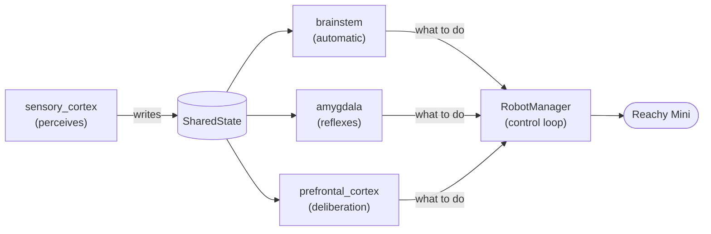

# Architecture

Why the code is organized this way. For what the project does and how to
run it, see the [README](./README.md).

## The goal

A creature doesn't run one program. It breathes without thinking, flinches
before it understands, and sometimes stops to consider. Reachy Alive is
built the same way, as layers that share one body:

- **automatic**: breathing and idle gestures, always running;
- **reflexes**: fast, local reactions that fire in milliseconds;
- **deliberation**: slow, considered responses that can take seconds.

The architecture exists to let these layers drive the same robot without
the slow ones freezing the fast ones, and to let someone add to one layer
without touching the others.

This is the target. Today only `brainstem` exists, and it still executes
its own gestures instead of handing them to `RobotManager` — see
[Known debt](#known-debt).

## The core constraint

The robot must keep moving while it thinks. A cloud LLM call takes 1-3
seconds; written naively, the robot freezes and looks dead — the exact
opposite of the point. Every decision below follows from this.

## Four rules

**1. Folders are named after brain regions; code goes where its speed fits.**
Fast, local, synchronous goes to `amygdala/`. Slow, remote, asynchronous
goes to `prefrontal_cortex/`. Reacting to a face can mean both: a startle
belongs in the first, a greeting in the second. Sorting by speed rather
than by topic keeps anything that can block out of the fast path — and the
brain itself works this way.

**2. The cortex never blocks the loop.**
LLM calls are async. The control loop keeps running while a request is in
flight.

**3. One writer per field in `SharedState`.**
A blackboard is the right fit for a single process with a few threads, but
it degenerates when anyone can write anywhere. Every field has an owning
module; the others only read.

**4. Dependencies are explicit, never global.**
`RecordedMoves` is injected into `LibraryMove` rather than built at module
level — otherwise a plain import downloads the library, including during
tests. Anything with a side effect at construction time is built in
`main.py` and passed down.

## Execution model

`main.py` is the composition root: it builds every object and wires them
together, once, at startup.

`RobotManager` owns the control loop. It is the only module that calls
`ReachyMini`. It makes no decisions — it asks a decision-maker what to do
and executes the answer.

Decision-makers (`IdleManager` today; reflexes and deliberation later) are
plain objects, testable without a robot.

## Moves

A move is one discrete gesture. `Move` defines the contract; `play()`
handles everything around the gesture so a move only describes motion.

Most gestures share one shape: a sequence of phases, each timed by its own
sound. That shape lives in `PhasedMove`, extracted once `yawning` and
`stretching` had duplicated the same ~60 lines of timing machinery. A move
written on top of it declares its phases and writes one pose per phase:
head, antennas and body yaw. The body was left out at first, because the
two moves it was extracted from never turned it; `sneezing` did.

`LibraryMove` wraps a recorded move from a Hugging Face dataset — Pollen's
emotion library, or one recorded with Marionette. No code at all.

A **mixed** move is a regular `PhasedMove` whose head is read from a
Marionette recording instead of computed. The head is recorded against a
file composed from the phase sounds themselves, so the recording and the
phases share one timeline: a phase boundary is a moment in the recording,
with nothing to measure by hand. That's why `_pose_at` receives
`elapsed_s` as well as `p` — a recording runs on one continuous clock,
while `p` restarts at every phase. `sneezing` is the only mixed move so
far, so there is no `MixedMove` base class: extracting one from a single
example would freeze the wrong shape.

**Moves are registered by hand, in `main.py`.** Nothing is loaded
automatically from a folder: each line in the list is a move someone
reviewed. What the review can't catch by eye, the tests do —
`test_pose_contract.py` samples every `PhasedMove` and fails if a pose
breaks the contract or sends the head below the reachable workspace, and
fails if a `PhasedMove` isn't in its list.

## Sound upload

On Wireless, playing a local file uploads it over HTTP first, which freezes
the gesture mid-motion. Sounds are therefore uploaded ahead of the gesture,
and `play_sound()` plays the copy already on the robot.

`IdleManager` picks the next gesture in advance and prepares it in a
background thread while the robot is still breathing, so the upload happens
during motion that doesn't care. Uploads are keyed by file name on the
robot, so each move re-uploads just before playing: two moves may ship a
sound with the same name.

What remains: the play command itself is an HTTP round trip, so a sound
starts slightly after its phase. Running the app on the robot rather than a
laptop would remove it.

## Known debt

`IdleManager.get_pose()` decides, executes (`behavior.play()`) **and**
signals with a `None` sentinel. It also prepares the next gesture. The
execution path is locked inside idle behavior, which will get in the way
once a second decision-maker exists.

Target: decision-makers return an intent, `RobotManager` is the only
executor. Scheduled for sprint C, when a second decision-maker exists to
validate the design — designing it cold would be guesswork.

## Accepted hardware limits

- **Streaming `set_target` from a far pose can take the daemon down.** It
  doesn't interpolate, so from the sleep pose it asks for a huge instant
  jump. Entry points ease into neutral with `goto_target` first.
- **Head below z = -170 mm wedges the IK solver permanently** — commands
  and sounds keep being accepted, nothing moves, until the daemon restarts
  ([#1417](https://github.com/pollen-robotics/reachy_mini/issues/1417)).
- **Antennas jitter at exactly vertical**, so neutral is ~10° off.
- Jitter on `set_target()` — upstream bug, not fixable from here.
- `push_audio_sample()` is broken on Wireless
  ([#601](https://github.com/pollen-robotics/reachy_mini/issues/601)),
  so gesture audio uses pre-generated `.wav` files played through
  `play_sound()` instead of streamed samples.

## Roadmap

**Done** — structure refactor: `moves/` at root, `RobotManager` lifted out of
`brainstem/`, dependencies injected.

**Current — v1 release.** Idle gestures of all three kinds (coded,
Marionette, mixed), contributor guides, README, CONTRIBUTING, CI, Hugging
Face Space. Ships early so gestures can be contributed while perception is
built.

**Next — perception.** `sensory_cortex/`: camera, motion and face detection,
writing to `SharedState`, plus the mechanism to aim the head at a point.
Nothing calls it yet — the robot still just breathes.

**Then — reflexes.** `amygdala/`, plus the decision/execution split. Innate
triggers only: a sudden noise, a face appearing, movement where there was
none. The milestone the project is built for: the robot perceives and reacts,
without waiting on anything slow.

**Then — deliberation.** `prefrontal_cortex/`: an async cloud LLM call, with
timeout and fallback. This is what decides to *look at* someone or comment on
what it sees, as opposed to reflexively startling.

**Then — arbitration.** Three decision-makers competing for one body; migrate
to a behavior tree.

**Then — memory.** `hippocampus/` conditioning: the cortex writes what it
judged, the amygdala reads it back in milliseconds. The robot's fast reaction
becomes right because it was slow once.