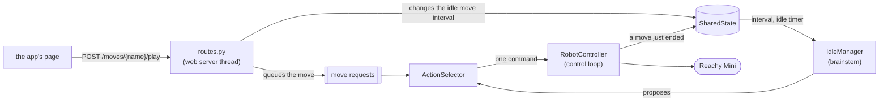
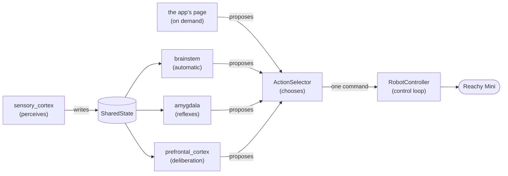

# Architecture

Why the code is organized the way it is. To install or run the app, see the
[README](./README.md); to write a move, see [moves/README.md](./reachy_alive/moves/README.md).

## The idea

A creature doesn't run one program. It breathes without thinking, flinches
before it understands, and sometimes stops to consider. Reachy Alive is
built the same way, as layers that share one body:

- **automatic**: breathing and idle moves, always running;
- **reflexes**: fast, local reactions that fire in milliseconds;
- **deliberation**: slow, considered responses that can take seconds.

One constraint shapes everything: **the robot must keep moving while it
thinks.** A cloud LLM call takes 1 to 3 seconds; written naively, the robot
would freeze and look dead, the exact opposite of the point. So the layers
never wait on each other, and none of them can stall the loop that moves the
robot.

## One tick, step by step

The robot runs one loop, 50 times a second, in its own thread. Each pass is
a *tick*, and every tick goes through the same three steps:

1. **Something proposes.** Today there are two sources: `IdleManager`
   (breathe, or play an idle move now and then) and the app's page (play the
   move someone clicked).
2. **The `ActionSelector` picks one.** A requested move wins over idle.
3. **The `RobotController` executes it**, and it is the only part that
   drives the robot.


```mermaid
flowchart LR
    page["the app's page"] -->|"POST /moves/{name}/play"| routes["routes.py<br/>(web server thread)"]
    routes -->|queues the move| queue[["move requests"]]
    routes -->|changes the idle move interval| state[("SharedState")]
    queue --> selector["ActionSelector"]
    idle["IdleManager<br/>(brainstem)"] -->|proposes| selector
    state -->|interval, idle timer| idle
    selector -->|one command| controller["RobotController<br/>(control loop)"]
    controller -->|a move just ended| state
    controller --> robot(["Reachy Mini"])
```

### Breathing, then an idle move

On most ticks, `IdleManager` proposes a breathing pose, and the
`RobotController` sends it to the robot. On the next tick, the next pose.

Meanwhile, `IdleManager` has already picked its next idle move, say a yawn,
and a delay drawn from the interval kept in `SharedState` (20 to 30 s by
default, adjustable from the app's page). It uploads the yawn's sounds in
the background while the robot keeps breathing. Once the delay has passed
since the last move ended, it proposes the yawn instead of a pose.

The `RobotController` plays it. The loop waits for the whole move to finish
(see [Known debt](#known-debt)), then records in `SharedState` that a move
just ended, which restarts the idle timer. On the next tick, breathing
resumes from neutral.

### Someone clicks "Sneezing"

- The page sends `POST /moves/sneezing/play`. The web server runs in its own
  thread: the route checks the name, drops the move in a queue, and answers
  at once. It never touches the robot.
- On the next tick, the `ActionSelector` finds the request. It tells
  `IdleManager` it was interrupted, so breathing will restart from neutral,
  and hands the sneeze to the `RobotController`.
- If several clicks arrive during one move, only the latest plays.
- From there, it goes like an idle move: played, its end recorded, then
  breathing again.

### What never happens

Nothing calls a move directly, and no thread but the loop's drives the
robot. Sources only propose; one component chooses; one executes. That is
what lets reflexes and deliberation join later without touching the rest.

## Vocabulary

- **Tick**: one pass of the control loop, 50 per second.
- **Move**: one discrete thing the robot does, from start to finish: a yawn,
  a sneeze, a hiccup. In code, a `Move`, written as a `PhasedMove` or wrapped
  from a recording as a `LibraryMove`.
- **Idle move**: a move `IdleManager` picks on its own, between breaths.
- **Breathing**: the continuous motion between moves. It is not a move: it
  never ends.
- **Decision-maker**: a module that proposes what the robot should do.
  Today, `IdleManager`; later, reflexes and deliberation. The app's page
  proposes too, through its routes.
- **Command**: an order for one tick, handed to the `RobotController` and
  executed once: hold this pose, or play this move.
- **`SharedState`**: the facts any module may read at any time, such as
  when the last move ended. Orders never go there.
- **The app's page**: the web page the app serves. It shows up next to
  Reachy Mini Control while the app runs, or at `http://localhost:8042`.

## Code map

```
reachy_alive/
├── main.py            Builds every part and wires them together; lists the idle moves.
├── shared_state.py    Facts shared across threads: the idle timer, the idle move interval.
├── routes.py          HTTP routes behind the app's page: list and play moves, read and change settings.
├── control/           From a proposal to the robot: commands, the ActionSelector, the RobotController.
├── brain/             The brain regions, sorted by speed (see rule 8).
│   └── brainstem/     Automatic behavior: breathing, and IdleManager..
├── moves/             The Move contract (base.py), the coded moves, and the guides to write one.
├── static/            The app's page: HTML, JavaScript, CSS.
├── assets/sounds/     Move sounds, next to the presets that made them.
└── scripts/           Developer tools, such as try-move.
tests/                 Mirrors the package. Runs without a robot, on every pull request.
```

Each package's `__init__.py` says, in a few lines, what the package is for.

## Rules

**1. The control loop never blocks.** Anything slow runs outside it: the web
server has its own thread, and deliberation will be asynchronous. The loop
keeps moving the robot while the rest thinks.

**2. One component executes.** Only the `RobotController` drives the robot,
from the loop's thread. Moves do talk to the robot, but only while the
`RobotController` plays them.

**3. One component chooses.** Decision-makers only propose; the
`ActionSelector` alone decides what runs each tick. When one proposal wins
over another, the loser isn't consulted, only told.

**4. Facts go in `SharedState`, orders travel as commands.** A fact stays
readable by anyone, at any time; an order is executed once. Every field of
`SharedState` has one owning module that writes it; the others only read.

**5. Moves describe; they don't drive.** A move written in code computes its
pose from the time elapsed, and the loop sends it. Rhythms are in seconds,
never in ticks, so a move doesn't depend on how fast the loop runs.

**6. Moves are registered by hand, in `main.py`.** Nothing is loaded
automatically from a folder: each line is a move someone reviewed. What
review can't catch by eye, tests do: `test_pose_contract.py` samples every
coded move and fails on a pose that breaks the contract or sends the head
out of reach.

**7. Dependencies are explicit, never global.** Anything with a side effect
when built, such as downloading a move library, is built in `main.py` and
passed down. A plain import never downloads anything, not even during tests.

**8. Folders named after brain regions, under `brain/`, hold the cognitive
modules, sorted by speed.** Fast, local and synchronous goes to `amygdala/`; slow, remote and
asynchronous goes to `prefrontal_cortex/`. Reacting to a face can mean
both: a startle belongs in the first, a greeting in the second. Sorting by
speed rather than by topic keeps anything that can block out of the fast
path, as the brain does. The plumbing they share (`control/`, `shared_state.py`, `routes.py`) 
takes plain names and stays at the package root: the metaphor is kept 
for what has a biological sense.

## Where it's going


```mermaid
flowchart LR
    senses["sensory_cortex<br/>(perceives)"] -->|writes| state[("SharedState")]
    state --> brainstem["brainstem<br/>(automatic)"]
    state --> amygdala["amygdala<br/>(reflexes)"]
    state --> cortex["prefrontal_cortex<br/>(deliberation)"]
    page["the app's page<br/>(on demand)"] -->|proposes| selector
    brainstem -->|proposes| selector["ActionSelector<br/>(chooses)"]
    amygdala -->|proposes| selector
    cortex -->|proposes| selector
    selector -->|one command| controller["RobotController<br/>(control loop)"]
    controller --> robot(["Reachy Mini"])
```

**Done: v1.** The decision/execution split: decision-makers propose, the
`ActionSelector` chooses, the `RobotController` executes. Idle moves of all
three kinds (coded, recorded in Marionette, mixed), a stable Move contract,
contributor guides, CI. The app's page plays any move on demand and sets the
idle move interval. The app is published on its Hugging Face Space and in
Reachy Mini Control's app store.

**Current: senses.** `sensory_cortex/` gives the robot four senses (inertial
unit, touch, hearing, vision), each writing timestamped facts to
`SharedState`. Nothing reacts yet: the robot still just breathes, and the
app's page shows what it perceives. Each fact is there for a reaction
planned below; raw signal (images, sound) stays inside its sense.

**Next: an interruptible body.** Moves run tick by tick: they return a pose
each tick, like breathing does, and the command to play a move goes away
(see [Known debt](#known-debt)). Gaze joins as a continuous motion layered
over breathing, with the mechanism to aim the head at a point. Nothing new
shows: the robot must behave exactly as before.

**Then: reflexes.** `amygdala/`: fast, local reactions to the senses' facts,
which interrupt whatever the robot is doing. The `ActionSelector` puts
reflexes first. Innate triggers only, two of them to start. The milestone
the project is built for: the robot perceives and reacts, without waiting
on anything slow.

**Then: deliberation.** `prefrontal_cortex/`: an asynchronous cloud LLM
call, with a timeout and a fallback. This is what decides to *look at*
someone, rather than reflexively glance.

**Then: arbitration.** Three decision-makers competing for one body: the
`ActionSelector` becomes a behavior tree.

**Later: memory.** `hippocampus/`: the cortex writes what it judged, the
amygdala reads it back in milliseconds. The robot's fast reaction becomes
right because it was slow once.

## Known debt

**Playing a move blocks the loop for the whole move.** Everything below
follows from it:

- a move can't be interrupted, not even by a future reflex;
- moves still talk to the robot themselves while they play (rule 2's
  exception);
- the command to play a move exists only because of it.

Target: moves return a pose each tick, like breathing does, and the loop
sends every pose itself. Scheduled as its own step, the interruptible body,
right before reflexes, which need interruption.

**A move requested from the app's page isn't prepared ahead.** Its sounds
upload just before it plays, which can add a short pause on a Wireless
robot. Idle moves don't have it: `IdleManager` prepares them while the robot
breathes.