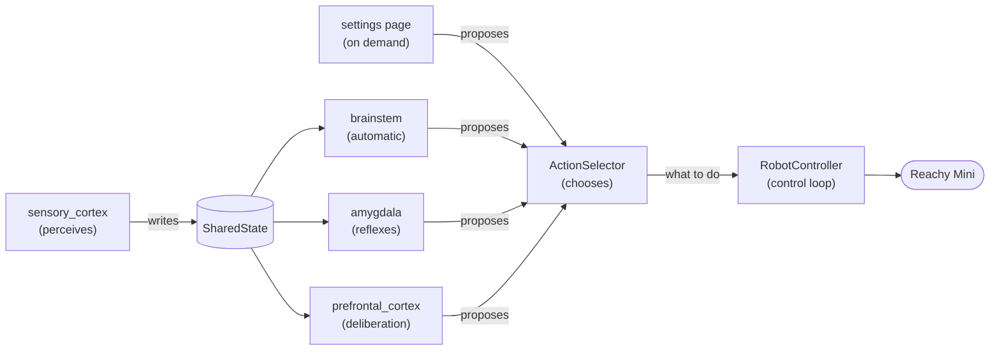

# Architecture

Why the code is organized this way. For what the project does and how to
run it, see the [README](./README.md).

## The goal

A creature doesn't run one program. It breathes without thinking, flinches
before it understands, and sometimes stops to consider. Reachy Alive is
built the same way, as layers that share one body:

- **automatic**: breathing and idle gestures, always running;
- **reflexes**: fast, local reactions that fire in milliseconds;
- **deliberation**: slow, considered responses that can take seconds.

The architecture exists to let these layers drive the same robot without
the slow ones freezing the fast ones, and to let someone add to one layer
without touching the others.

```mermaid
flowchart LR
    senses["sensory_cortex<br/>(perceives)"] -->|writes| state[("SharedState")]
    state --> brainstem["brainstem<br/>(automatic)"]
    state --> amygdala["amygdala<br/>(reflexes)"]
    state --> cortex["prefrontal_cortex<br/>(deliberation)"]
    page["settings page<br/>(on demand)"] -->|proposes| selector
    brainstem -->|proposes| selector["ActionSelector<br/>(chooses)"]
    amygdala -->|proposes| selector
    cortex -->|proposes| selector
    selector -->|what to do| manager["RobotController<br/>(control loop)"]
    manager --> robot(["Reachy Mini"])
```

This is the target. For the moment, only `brainstem` and the settings page propose, and
the `ActionSelector` chooses between them.

## The core constraint

The robot must keep moving while it thinks. A cloud LLM call takes 1-3
seconds; written naively, the robot freezes and looks dead — the exact
opposite of the point. Every decision below follows from this.

## Four rules

**1. Folders are named after brain regions; code goes where its speed fits.**
Fast, local, synchronous goes to `amygdala/`. Slow, remote, asynchronous
goes to `prefrontal_cortex/`. Reacting to a face can mean both: a startle
belongs in the first, a greeting in the second. Sorting by speed rather
than by topic keeps anything that can block out of the fast path — and the
brain itself works this way.

**2. The cortex never blocks the loop.**
LLM calls are async. The control loop keeps running while a request is in
flight.

**3. One writer per field in `SharedState`.**
A blackboard is the right fit for a single process with a few threads, but
it degenerates when anyone can write anywhere. Every field has an owning
module; the others only read.

**4. Dependencies are explicit, never global.**
`RecordedMoves` is injected into `LibraryMove` rather than built at module
level — otherwise a plain import downloads the library, including during
tests. Anything with a side effect at construction time is built in
`main.py` and passed down.

## Execution model

`main.py` is the composition root: it builds every object and wires them
together, once, at startup.

`RobotController` owns the control loop. It makes no decisions: each tick, it
asks for a command (`commands.py`) and executes it. Decision-makers never
drive the robot. Moves do talk to the robot, but only while `RobotController`
executes a `PlayMove`, from the loop's thread. It also records in
`SharedState` when a move ends, whoever asked for it: it is the only module
that knows for sure.

Decision-makers (`IdleManager` today; reflexes and deliberation later)
propose; the `ActionSelector` chooses one proposal per tick and hands it to
`RobotController`. Today, a move requested from the settings page wins over
idle behavior, and if several requests arrive during one move, only the
latest plays. The idle manager isn't consulted while it loses, only told
(`interrupt()`), so breathing restarts from neutral. The `ActionSelector` is
where a behavior tree will go. All of them are plain objects, testable
without a robot.

State and orders travel separately. `SharedState` holds facts any module can
read at any time. A command is an order: handed to `RobotController`, executed
once. The split came earlier than planned: moves requested from the
settings page are a second decision-maker, which is what the design was
waiting for.

## Moves

A move is one discrete gesture. `Move` defines the contract; `play()`
handles everything around the gesture so a move only describes motion.
Contributors write a `PhasedMove` or a `LibraryMove`; `Move` itself is never
subclassed directly, because its `_perform` is the internal loop and will
change when gestures run tick by tick.

Most gestures share one shape: a sequence of phases, each timed by its own
sound. That shape lives in `PhasedMove`, extracted once `yawning` and
`stretching` had duplicated the same ~60 lines of timing machinery. A move
written on top of it declares its phases and writes one pose per phase:
head, antennas and body yaw. The body was left out at first, because the
two moves it was extracted from never turned it; `sneezing` did.

`LibraryMove` wraps a recorded move from a Hugging Face dataset — Pollen's
emotion library, or one recorded with Marionette. No code at all.

A **mixed** move is a regular `PhasedMove` whose head is read from a
Marionette recording instead of computed. The head is recorded against a
file composed from the phase sounds themselves, so the recording and the
phases share one timeline: a phase boundary is a moment in the recording,
with nothing to measure by hand. That's why `_pose_at` receives
`elapsed_s` as well as `p` — a recording runs on one continuous clock,
while `p` restarts at every phase. `sneezing` is the only mixed move so
far, so there is no `MixedMove` base class: extracting one from a single
example would freeze the wrong shape.

**Moves are registered by hand, in `main.py`.** Nothing is loaded
automatically from a folder: each line in the list is a move someone
reviewed. What the review can't catch by eye, the tests do —
`test_pose_contract.py` samples every `PhasedMove` and fails if a pose
breaks the contract or sends the head below the reachable workspace, and
fails if a `PhasedMove` isn't in its list.

## Settings page

The app serves a page (the ⚙️ in Reachy Mini Control) that plays any move on
demand. `GET /moves` lists the move names; `POST /moves/{name}/play` checks
the name (404 if unknown) and queues the move (202: accepted, played as soon
as possible). The route only validates and queues: the control loop picks
the request up on its next tick, through the `ActionSelector`.

A move's name is its identifier in these routes: lowercase words joined by
hyphens, like recorded moves (`hiccup-full`). Coded moves derive it from
their class name (`DeepBreath` → `deep-breath`). The page builds its labels
from the names.

Volume and microphone stay in Reachy Mini Control: they are robot-wide
settings, not this app's.

## Sound upload

On Wireless, playing a local file uploads it over HTTP first, which freezes
the gesture mid-motion. Sounds are therefore uploaded ahead of the gesture,
and `play_sound()` plays the copy already on the robot.

`IdleManager` picks the next gesture in advance and prepares it in a
background thread while the robot is still breathing, so the upload happens
during motion that doesn't care. Uploads are keyed by file name on the
robot, so each move re-uploads just before playing: two moves may ship a
sound with the same name.

What remains: the play command itself is an HTTP round trip, so a sound
starts slightly after its phase. Running the app on the robot rather than a
laptop would remove it.

A move requested from the settings page isn't prepared ahead: `play()`
uploads its sounds just before it starts, which can add a short pause on
Wireless.

## Known debt

`Move.play()` blocks the control loop for the whole gesture. Everything
below follows from it:

- a gesture can't be interrupted;
- `PlayMove` exists only because of it;
- moves still talk to the robot themselves during `play()`.

Target: gestures return a pose each tick, like breathing does, and
`PlayMove` goes away. Scheduled with reflexes, which need interruption
anyway.

## Accepted hardware limits

- **Robot inert while the daemon reports healthy.** The motor controller
  retries reads but not writes, and silently drops write errors: a transient
  serial error can lose the torque-enable order. The daemon then reports
  `enabled` and `nb_error: 0`, accepts every command, and nothing moves. Only
  restarting the daemon service recovers
  ([motor-controller#47](https://github.com/pollen-robotics/reachy-mini-motor-controller/issues/47)).
- **Ease into neutral before streaming.** `set_target` doesn't interpolate,
  so from the sleep pose it asks for a huge instant jump. Entry points ease
  into neutral with `goto_target` first. It reduces motor strain but doesn't
  prevent the issue above.
- **Head below z = -170 mm wedges the IK solver permanently** — commands
  and sounds keep being accepted, nothing moves, until the daemon restarts
  ([#1417](https://github.com/pollen-robotics/reachy_mini/issues/1417)).
- **Antennas jitter at exactly vertical**, so neutral is ~10° off.
- Jitter on `set_target()` — upstream bug, not fixable from here.
- `push_audio_sample()` is broken on Wireless
  ([#601](https://github.com/pollen-robotics/reachy_mini/issues/601)),
  so gesture audio uses pre-generated `.wav` files played through
  `play_sound()` instead of streamed samples.

## Roadmap

**Done** — structure refactor: `moves/` at root, `RobotController` lifted out of
`brainstem/`, dependencies injected. Decision/execution split: decision-makers
return commands, `RobotController` executes them.

**Current — v1 release.** Idle gestures of all three kinds (coded,
Marionette, mixed), a stable Move contract, contributor guides, README,
CONTRIBUTING, CI, Hugging Face Space, settings page that plays any move on
demand. Ends once the app is published and the promo video is out, so
gestures can be contributed while perception is built.

**Next — perception.** `sensory_cortex/`: camera, motion and face detection,
writing to `SharedState`, plus the mechanism to aim the head at a point.
Nothing calls it yet — the robot still just breathes.

**Then — reflexes.** `amygdala/`, plus gestures that run tick by tick, so a
reflex can interrupt one. Innate triggers only: a sudden noise, a face
appearing, movement where there was none. The milestone the project is built
for: the robot perceives and reacts, without waiting on anything slow.

**Then — deliberation.** `prefrontal_cortex/`: an async cloud LLM call, with
timeout and fallback. This is what decides to *look at* someone or comment on
what it sees, as opposed to reflexively startling.

**Then — arbitration.** Three decision-makers competing for one body; migrate
the `ActionSelector` to a behavior tree.

**Then — memory.** `hippocampus/` conditioning: the cortex writes what it
judged, the amygdala reads it back in milliseconds. The robot's fast reaction
becomes right because it was slow once.