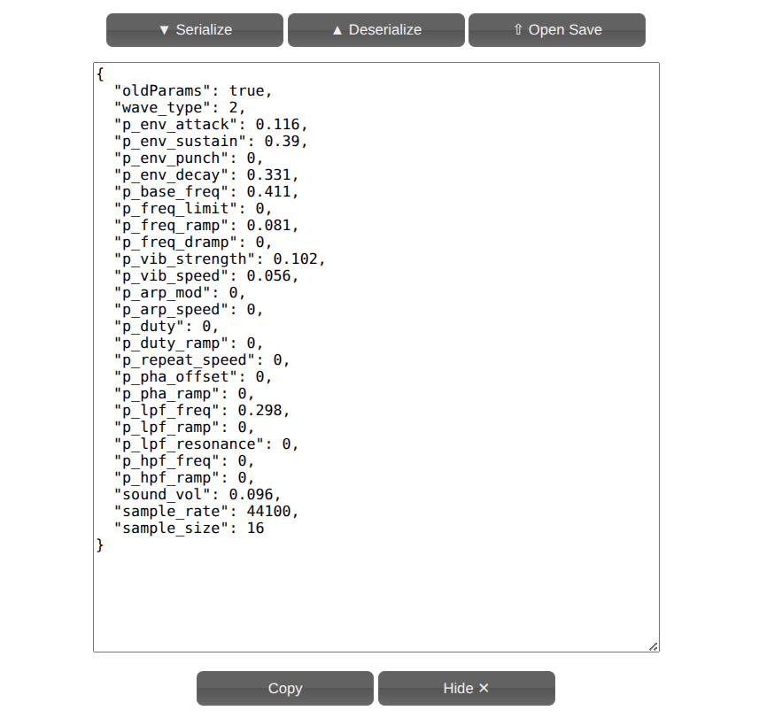
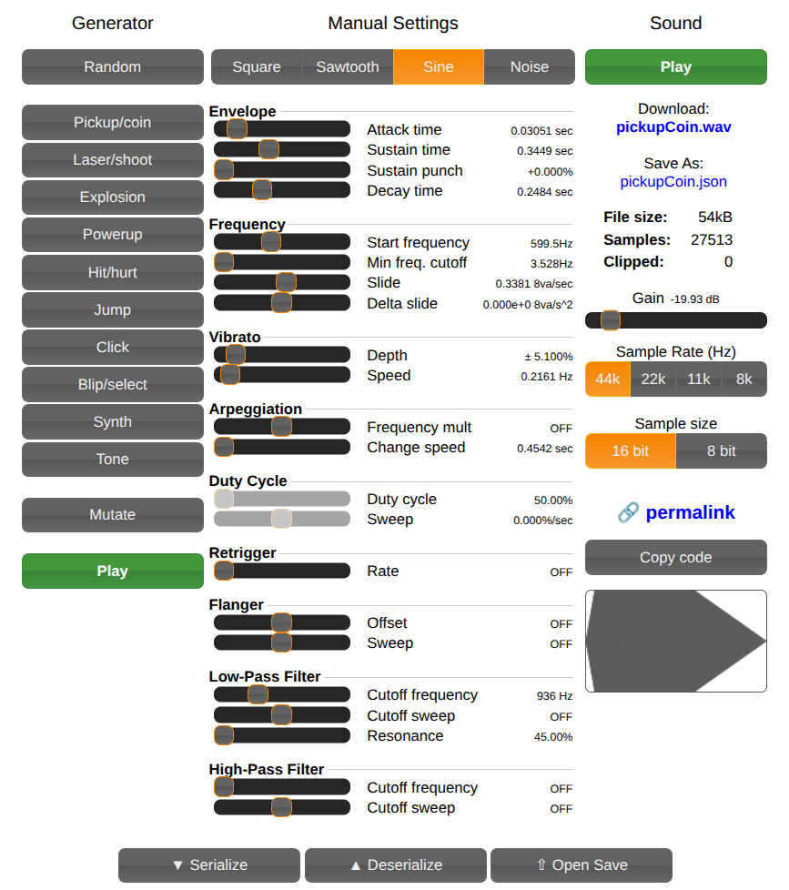

# Sounds

Short audio clips played during moves and reactions. Pollen's own robot
sounds were made with a slide whistle, so anything added here should stay
in that family: a **round, sustained tone that glides** — not a
video-game blip.

## Making one

Build it in [jsfxr](https://sfxr.me), in the browser, nothing to install.

Don't start from scratch: load [`presets/base.jsfxr.json`](presets/base.jsfxr.json)
and change only two things, **Start frequency** and **Slide**. Same
voice, different mood. That's what keeps every sound in the project
sounding like the same robot.

Two ways to load it in jsfxr:

- **Open Save**, then pick [`presets/base.jsfxr.json`](presets/base.jsfxr.json) from disk.
- **Deserialize**: click it to open the text box, paste in the file's
  JSON content, then click **Deserialize** again to apply it.

  

Once loaded, the generator panel reflects the preset's settings — this
is what `base.jsfxr.json` looks like:



If you do want to build one from zero:

| Setting | Value | Why |
|---|---|---|
| Waveform | **Sine** | A whistle is a near-pure tone. Square or sawtooth sound like chiptune |
| Attack time | ~0.03 s | Soft start — breath never begins abruptly |
| Sustain time | ~0.35 s | The tone holds, giving the glide time to be heard |
| Sustain punch | 0 % | No percussive accent |
| Decay time | ~0.25 s | Soft fade out |
| Start frequency | 400–800 Hz | Higher reads as brighter, more alert |
| **Slide** | ±1.0 8va/s | **The key one — this is the whistle's slide.** Negative falls (tiredness, a sigh), positive rises (surprise, a question) |
| Delta slide | 0 | Constant glide, like pushing a real slide |
| Vibrato depth | 5–10 % | Very slight. Human breath is never perfectly steady |
| Vibrato speed | 4–6 Hz | Slow. Faster sounds electronic |
| Low-pass cutoff | 2000–3000 Hz | Takes the edge off |
| Everything else | OFF | Arpeggiation, flanger and friends all read as video game |

Export **both** files: the `.wav` here, and — via *Serialize* or *Save* — the
`.json` preset into `presets/`. The preset is what lets the next person
pick up where you left off.

> jsfxr can't mix noise into a sine wave, so you won't get the
> breathiness of a real whistle. Close is good enough.

## Sounds with several parts

A sneeze is a sniff, a pause, then the sneeze itself. Build each part
separately in jsfxr, then join them:

```python
from reachy_alive.scripts.compose_sound import concatenate

concatenate(
    [("sniff.wav", 0.3), ("sneeze.wav", 0.15), ("sigh.wav", 0.0)],
    "sneezing.wav",
)
```

Each number is the silence *after* that part, in seconds. Those silences
are what give the sound its rhythm — expect to try a few values.

All parts must share the same sample rate (jsfxr exports at 44k, 22k, 11k
or 8k). Mixing rates plays the result at the wrong speed.

## Playing one

```python
reachy_mini.media.play_sound(str(MY_SOUND_PATH))
```

Non-blocking, so a gesture keeps running while the sound plays. See
[`../../moves/README.md`](../../moves/README.md) for how to fire it at
the right moment in a gesture.